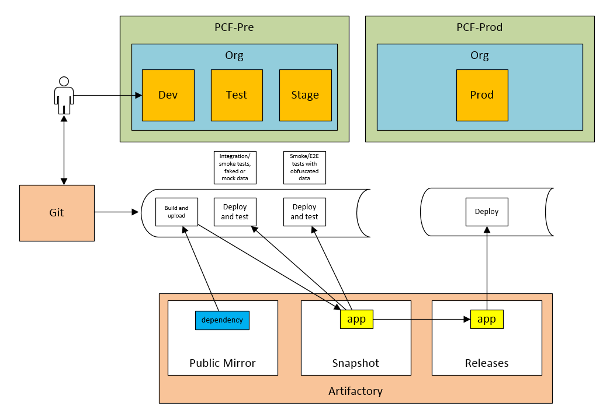

:data-uri:
= Sample Spring Cloud Service Pipelines

The master branch uses http://cloud.spring.io/spring-cloud-pipelines/[Spring Cloud Pipelines] to create pipelines for a single
small Spring Boot https://git.web.boeing.com/dte_replatforming/sample-spring-cloud-svc[application] to demonstrate how easy it is to customize for your own microservices.
These pipelines are modified slightly from the official https://github.com/spring-cloud/spring-cloud-pipelines#spring-cloud-pipelines[source code] because our application
does not require https://cloud.spring.io/spring-cloud-netflix/[Eureka] or https://cloud.spring.io/spring-cloud-contract/[Spring Cloud Contract] as
demonstrated by the http://cloud.spring.io/spring-cloud-pipelines/#quick-start[sample applications] for which the official pipelines are initially designed to use.

== Customized Pipelines

* https://git.web.boeing.com/dte_replatforming/ci-pipelines/blob/master/concourse/README.adoc[Sample Spring Cloud Service Concourse]
* https://git.web.boeing.com/dte_replatforming/ci-pipelines/blob/master/jenkins/README.adoc[Sample Spring Cloud Service Jenkins]

== Gradle Modifications

You need to make the following changes to your `build.gradle`.

1. Make sure your `gradle/` directory isn't being ignored and is checked into git.
2. Make sure any scripts in your project such as `gradlew` are checked in as executable. You can run this command to add executable permissions to a file that's currently in git.
```bash
   git update-index --chmod=+x <path-to-file>
   git push
```
3. Make sure your `build.gradle` is set up correctly for retrieving and publishing from/to https://sres.web.boeing.com[Artifactory].

For example, the following commits were made to `Java_REST_API_Template` to configure it for the pipeline:

* https://git.web.boeing.com/dte_replatforming/Java_REST_API_Template/commit/d070353e89fb9ad3fad38270c3bfa13615b16076#10f9c88cfa3af2916d822dc0f6c625065840dec4[Copy `pipeline.gradle` into your `gradle/` directory.]
* https://git.web.boeing.com/dte_replatforming/Java_REST_API_Template/commit/d070353e89fb9ad3fad38270c3bfa13615b16076#fbe448ebfc3eb2d4e308f6b8b043666f5b57235e[Add `gradle-wrapper.properties`.]
* https://git.web.boeing.com/dte_replatforming/Java_REST_API_Template/commit/37f00b877733164ac03bf9b6851310415747a5a2[Add executable permission to `gradlew`.]
* https://git.web.boeing.com/dte_replatforming/Java_REST_API_Template/commit/b7fec19ae6205401026ac475bdcdcd38ca1b1432[Configure `build.gradle` for `ci-pipelines`.]
* https://git.web.boeing.com/dte_replatforming/Java_REST_API_Template/commit/0873fee06e3f9346f1f376b04ec1e6a88b1f788d[Ensure group ID is set in `build.gradle`.]
* https://git.web.boeing.com/dte_replatforming/Java_REST_API_Template/commit/13c0560f1a0cff39422a32d3a539f6db483d7cca[Don't ignore gradle directory which contains the wrapper.]
* https://git.web.boeing.com/dte_replatforming/Java_REST_API_Template/commit/c2309a5fb96fcdbeb942ddeb4b0ff5a476c2b38b[Make sure you have a `settings.gradle` file **with** rootProject.name appropriately set.]

== References

* http://cloud.spring.io/spring-cloud-pipelines/#quick-start[Spring Cloud Pipelines Quickstart]
* http://cloud.spring.io/spring-cloud-pipelines/spring-cloud-pipelines.html[Spring Cloud Pipelines Documentation]

== Configuring for use with Pivotal Cloud Foundry (Concourse)


=== If you do not have a PCF account
* Request a Universal Security Groups from http://star.web.boeing.com/star/[STAR > BAAM Windows]
** it is recommended that you name the group with this pattern _orgname_rolename_ (e.g. dtemove_developer)
** You can review the Org, Space, Role structure of PCF here: http://docs.pivotal.io/pivotalcf/1-9/concepts/roles.html
** If you do not have a service account (for automation) request one here: `TODO`
* After you group is created, request an account with PCF.
** Email Andrew Slifka <andrew.m.slifka@boeing.com> and request an Org 
** The recommended setup would be an Org on PCF-Pre with three spaces (Dev, Test, and Stage) and the same Org in PCF-Prod with a single Prod space.
** You should request the Universal Security Group be given the space_developer role for the Dev space and space_auditor role for Test, Stage, and Prod
** You should also have the service account be assigned space_developer role for Test, Stage, and Prod

=== Configuring the credentials.yml
* Copy the `concourse/credentials-sample.yml` and rename locally as `credentials.yml` (DO NOT check this file into source control)
** The top section should have all of the parameters that need to be added by you.  The Default section at the bottom of the file contains parameters that normally should be left alone.

=== Setting the pipeline
* you will use fly to set the pipeline, if you do not have fly you can download the correct version from the concourse UI.
** navigate to http://10.59.227.243:8080 and click on the icon for you OS to download the correct version.
** add the file to you PATH so you can access it from any directory.

.Windows 7 users
****
There are some issues with fly with the latest Boeing Windows 7 blockpoint.  As an alternative windows 7 users can use the included Vagrant VM to launch and run fly.

* If you havent already, http://java.web.boeing.com/artifactory/webapp/#/artifacts/browse/tree/General/Tools/Vagrant/1.9.1[Install Vagrant]
* Manually download the RHEL7 box https://sres.web.boeing.com/artifactory/vagrant-local/rhel7u2-bp0-dev.box[rhel7u2-bp0-dev.box] (save the file to somewhere easy, e.g. c:\temp)
* run: `vagrant box add c:\temp\rhel7u2-bp0-dev.box --name rhel7u2-bp0-dev --insecure`
* cd into to `ci-pipelines` repo
* run: `vagrant up`
* run: `vagrant ssh`
* you should now be in the VM
* run: `cd /vagrant/concourse`
* you should be good to work with concourse now.  If you see an `/bin/sh^M: bad interpreter: No such file or directory` error when running the shell scripts it is because you have windows line endings.  The VM has a utility to change that.  Run `dos2unix *.sh`

****

** run the `./login.sh` from the `/concourse` directory
** run the `./set_pipeline.sh` to set the pipeline

The pipeline should kick off automatically 
